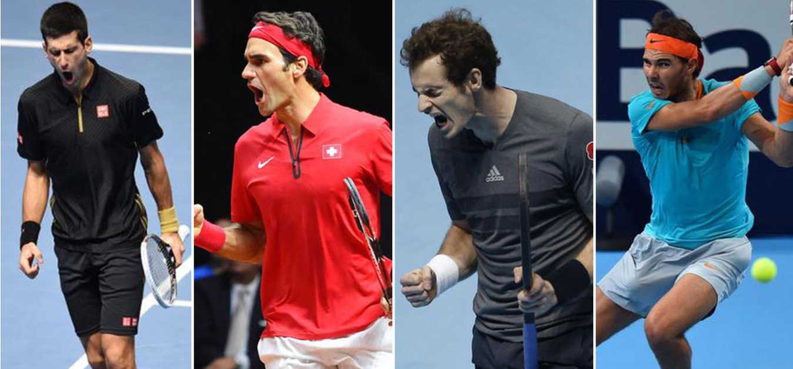

 

#  Clustering des profils joueurs de Tennis  
    
      
        

  
  ##  Cadre général du projet 
  
Ce projets consiste à définir les profils des joueurs de Tennis selon leur style de jeu. En se basant sur la base de données ATP, on va définir des classeurs qui décrivent un style de jeu, et on va attribuer chaque joueur à un classeur selon ces caractéristiques.  
  
Ce clustering va nous permettre de mieux caractériser les joueurs, et même prédir les performances d'un joueur selon les caractéristiques d'un match et selon son adversaire.

  
  ##  Variables utilisées 

- **minutes** : La durée du match

- **l/w_ace** : Nombre des services gagnants par match

- **l/w_df** : Nombre de services gagnés par doubles fautes de l'adversaire (par match)

- **l/w_svpt** : Nombre de service servi (par match)

- **l/w_1stIn** : Nombre de services réussis du premier coup

- **l/w_1stWon** : Nombre de fois où le joueur a gagné le premier point dès son premier service  

- **l/w_2ndWon** : Nombre de fois où le joueur a gagné le premier point dès le deuxième service

- **l/w_SvGms** : Nombre de parties où le joueur a servi

- **l/w_bpSaved** : winner's number of break points saved (à changer après)

- **l/w_bpFaced** : winner's number of break points faced (à changer après)

- **winner/loser_ht**: Taille du joueur

    
